# Welcome to NIPTviewer

NIPTviewer is a visualisation tool, mainly developed to plot data origination from Illumina VeriSeq NIPT Solution v1 tool. Developed to make result interpretation easier by:  

**1**: Ploting data over time to make it easier to compare runs. 

**2**: Introducing safe guards againts human errors, by only allowing direct import of output files which removes the possibity of copy and paste errors.

NIPTviewer is developed using [Django](https://www.djangoproject.com/), a web framework which enables rapid development. [NVD3](https://nvd3.org/) is used for generating plots.

## Results

For interactive and higher resolution images please go to [VISUALIZATION -> Results](visualisation_result.md)

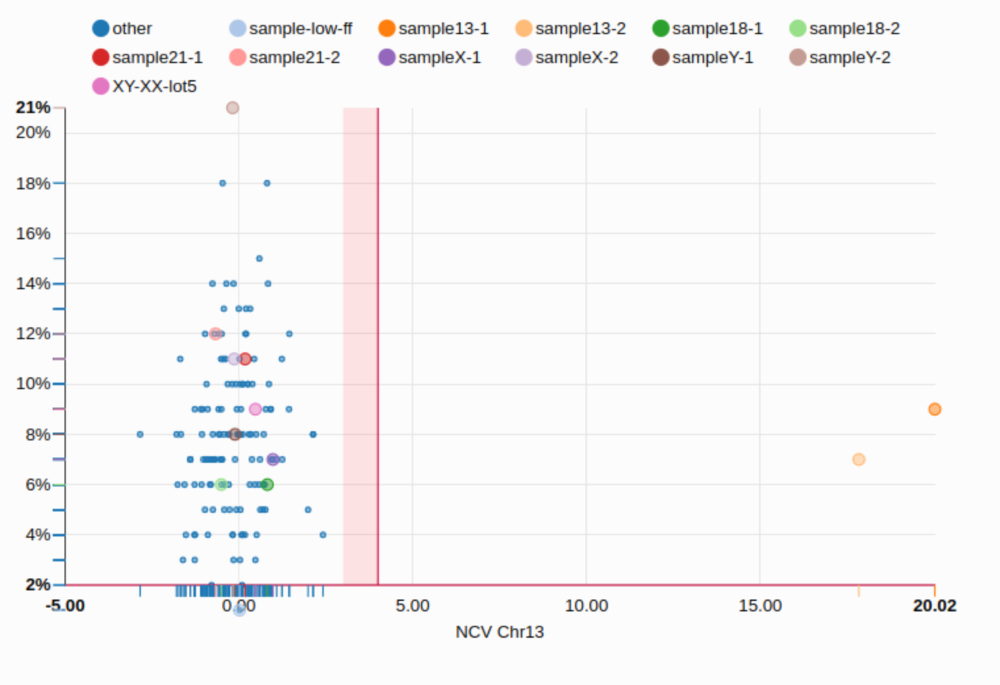{: style="height:150px;width:300px"}
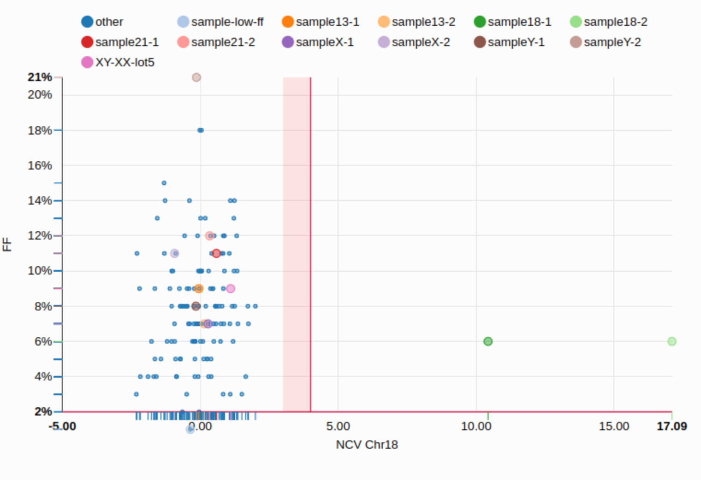{: style="height:150px;width:300px"}
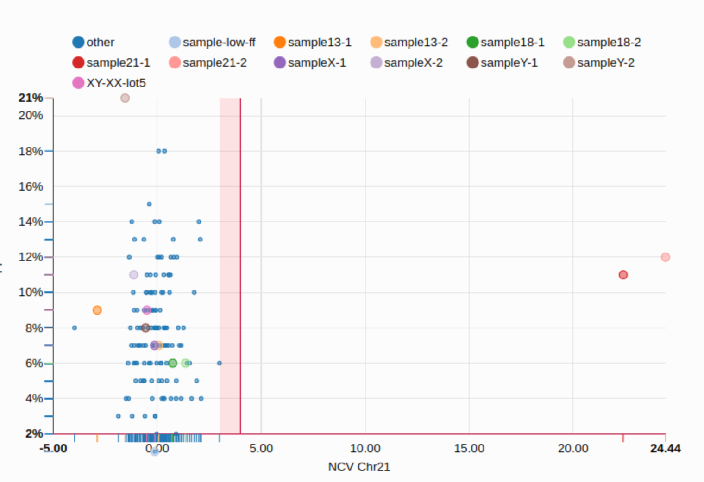{: style="height:150px;width:300px"}
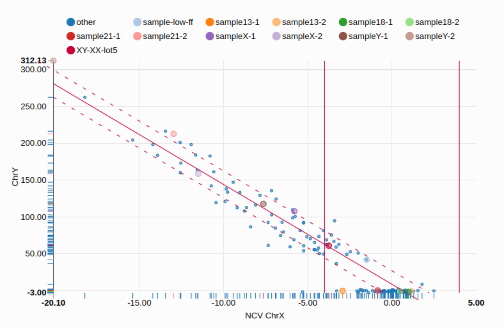{: style="height:150px;width:300px"}

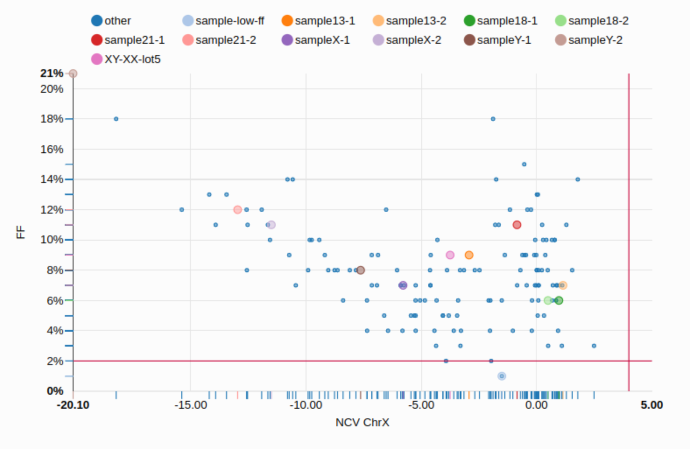{: style="height:150px;width:300px"}
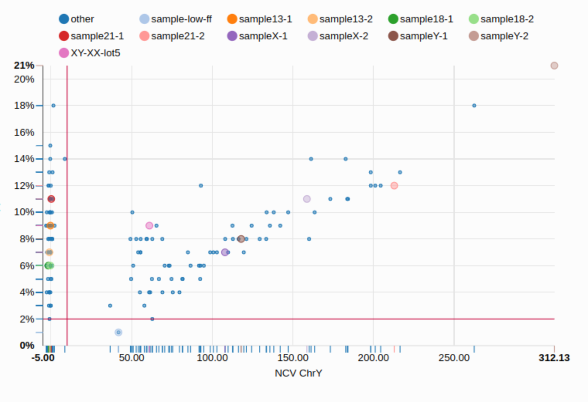{: style="height:150px;width:300px"}

 

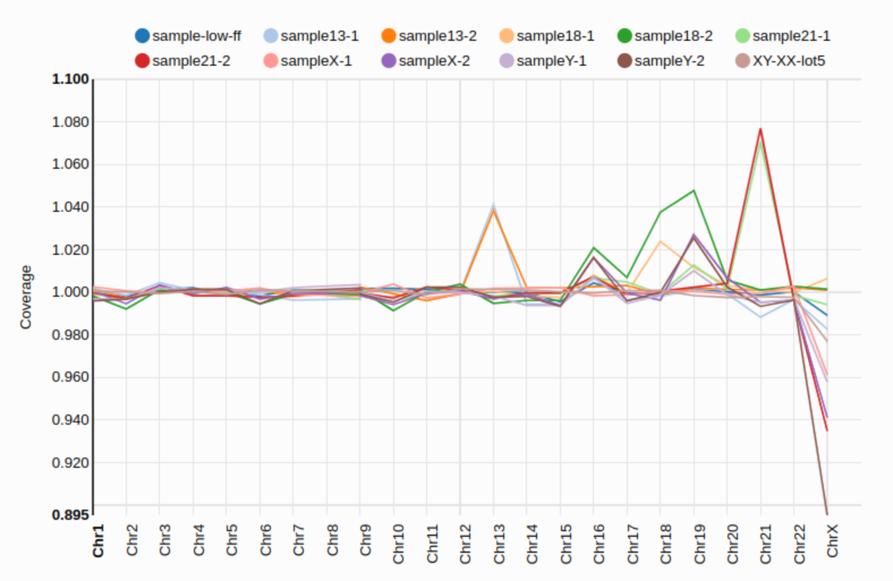{: style="height:150px;width:300px"}

## QC Plots

For interactive and higher resolution images please go to [VISUALIZATION -> QC](visualisation_qc.md)

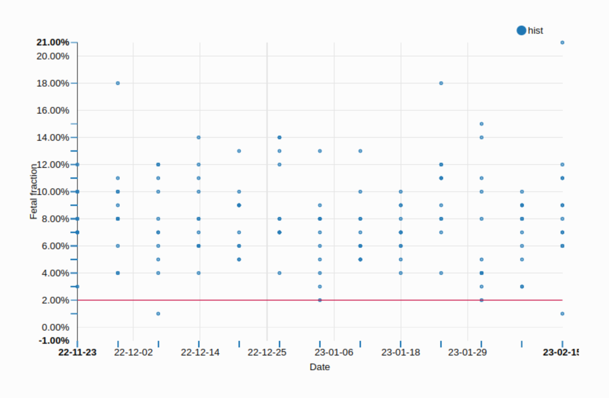{: style="height:150px;width:300px"}
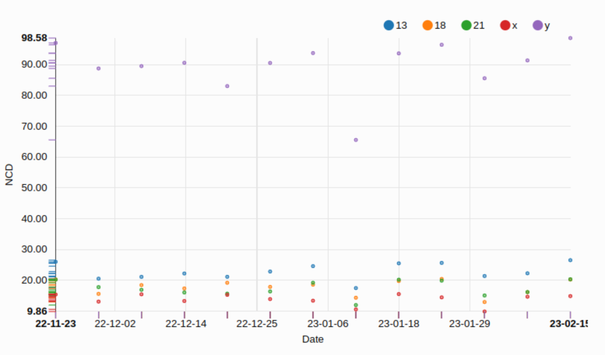{: style="height:150px;width:300px"}

 

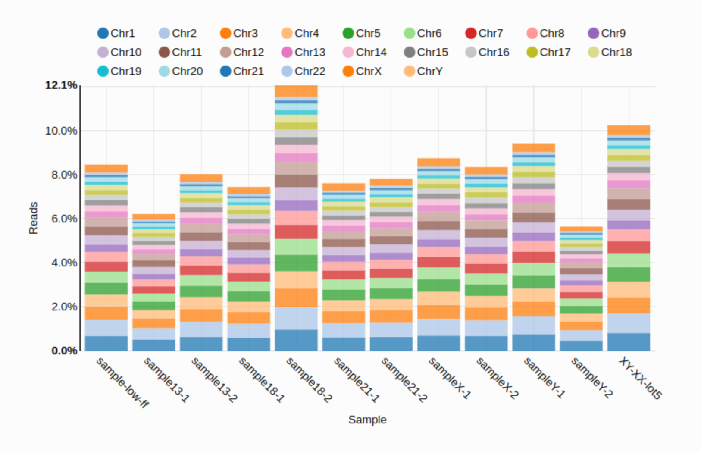{: style="height:150px;width:300px"}
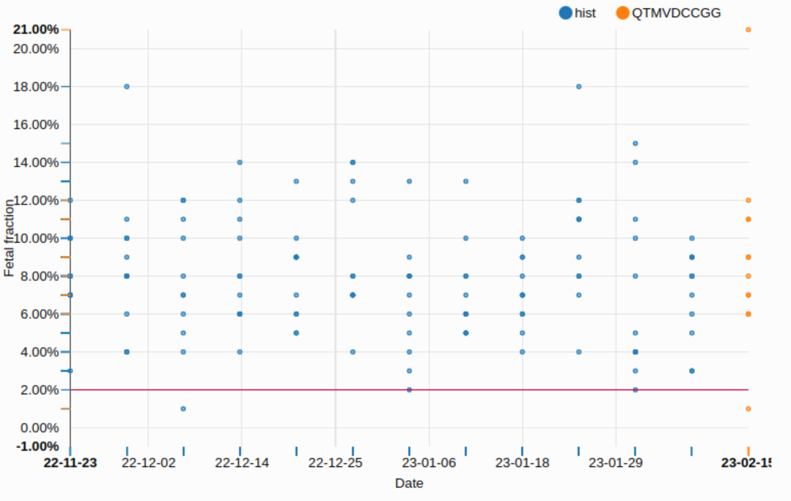{: style="height:150px;width:300px"}